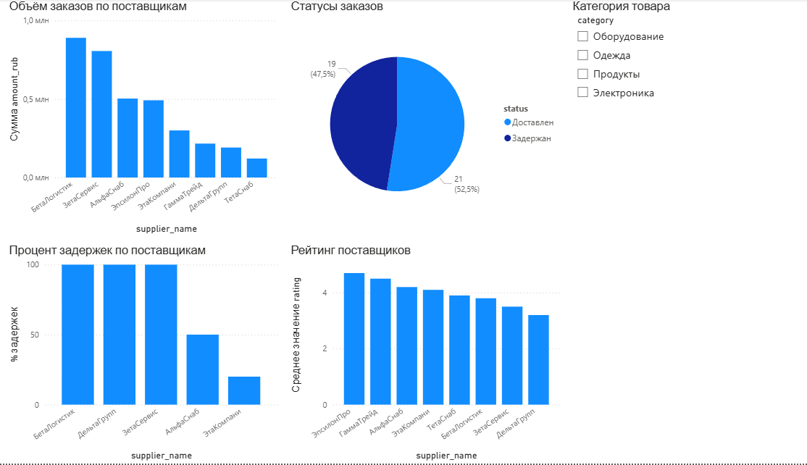

# Проект 2: Аналитика поставщиков в Power BI

Дашборд для оценки эффективности поставщиков — смотрим кто задерживает, 
кто везёт больше и у кого лучший рейтинг.

## Что внутри

1. Объём заказов по каждому поставщику
2. Процент задержек — считала через DAX-меру
3. Рейтинг поставщиков
4. Фильтр по категории товара — можно смотреть только электронику или одежду

## Новое по сравнению с Проектом 1

1. Две связанные таблицы (поставщики + заказы)
2. DAX-меры: COUNTROWS, FILTER, DIVIDE, AVERAGE
3. Срез для интерактивной фильтрации

## Инструменты

Power BI Desktop, DAX, CSV

## Превью

